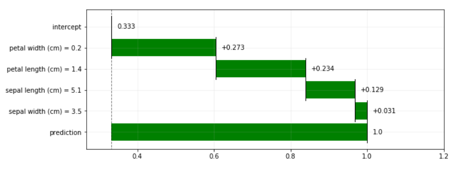

# piBreakDown
python version of iBreakDown

## Installation

Clone the repository, then open console in piBreakDown/piBreakDown directory and run

```
pip install . 
```

## Example

### Import necessary packages

```
from piBreakDown.Attributions import Attributions
from piBreakDown.PlotUtils import PlotUtils
from sklearn.ensemble import RandomForestClassifier
import pandas as pd
from sklearn.datasets import load_iris
```

### import some dataset

```
iris = load_iris()
data = pd.DataFrame(iris['data'])
target = iris['target']
```

You need to set the column names to strings

```
data.columns = iris.feature_names
```

### Fit your data

```
rf = RandomForestClassifier()
rf.fit(data, target)
```

### Use local_attributions

```
attr = Attributions(rf, data, 'Class')
results = attr.local_attributions(data.loc[0,:], # observation to explain
                                classes_names = [0,1,2]) # available classes_names
```

### Draw the plot

```
PlotUtils.plot_contribution(results, 
                                plot_class = 0) # class to plot
```

The results are displayed below


